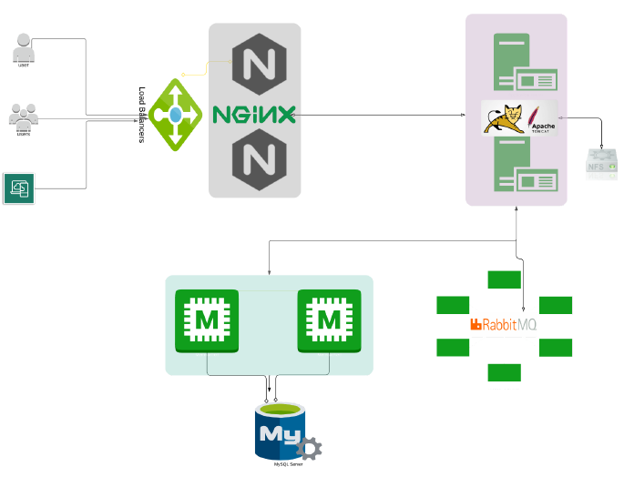

# Vprofile-project
In this project, we will have a social media application written in Java that will be served by an Apache Tomcat web server. We have an Nginx server acting as a load balancer, which will have an IP address through which we can access the application. We also have a message broker, as an example, that connects Apache to the database, which stores user information such as usernames and passwords. The database uses an in-memory storage system, Memcached, to speed up the response time of the database. For this project, we have two ways to provision it: manually or automatically. Here, we will explain the manual method step by step.
Arquitecture:

# VPROFILE PROJECT SETUP
## Prerequisite
- Oracle VM Virtualbox
- Vagran
- Vagrant plugins
    - vagrant plugin install vagrant-hostmanager 
- Git bash or equivalent editor

## VM SETUP
1. Clone source code.
2. Cd into the repository.
3. Switch to the main branch.
4. cd into vagrant/Manual_provisioning

Bring up vm’s 
~~~
$ vagrant up
~~~
NOTE: Bringing up all the vm’s may take a long time based on various factors.
If vm setup stops in the middle run “vagrant up” command again.
INFO: All the vm’s hostname and /etc/hosts file entries will be automatically updated.
## Provisionin
Services
1. Nginx: Web Service
2. Tomcat: Application Server
3. RabbitMQ: Broker/Queuing Agent
4. Memcache: DB Caching
5. ElasticSearch: Indexing/Search service
6. MySQL: SQL Database
### Setup should be done in below mentioned order
1. MySQL (Database SVC)
2. Memcache (DB Caching SVC)
3. RabbitMQ (Broker/Queue SVC)
4. Tomcat (Application SVC)
5. Nginx (Web SVC)

# MySql Setup
The symbol # means that it should be the root user.

Login to the db vm
~~~
$ vagrant ssh db01
~~~
Verify Hosts entry, if entries missing update the it with IP and hostnames
~~~
# cat /etc/hosts
~~~
Update OS with latest patches
~~~
# yum update -y
~~~
Set Repository
~~~
# yum install epel-release -y
~~~
Install Maria DB Package
~~~
# yum install git mariadb-server -y
~~~
Starting & enabling mariadb-server
~~~
# systemctl start mariadb
# systemctl enable mariadb
~~~
RUN mysql secure installation script.
~~~
# mysql_secure_installation
~~~
NOTE: Set db root password, I will be using admin123 as password

~~~
Set root password? [Y/n] Y
New password:
Re-enter new password:
Password updated successfully!
Reloading privilege tables..
... Success!
By default, a MariaDB installation has an anonymous user, allowing anyone
to log into MariaDB without having to have a user account created for
them. This is intended only for testing, and to make the installation
go a bit smoother. You should remove them before moving into a
production environment.
Remove anonymous users? [Y/n] Y
... Success!
Normally, root should only be allowed to connect from 'localhost'. This
ensures that someone cannot guess at the root password from the
network.
Disallow root login remotely? [Y/n] n
... skipping.
By default, MariaDB comes with a database named 'test' that anyone can
access. This is also intended only for testing, and should be removed
before moving into a production environment.
Remove test database and access to it? [Y/n] Y
- Dropping test database...
... Success!
- Removing privileges on test database...
... Success!
Reloading the privilege tables will ensure that all changes made so far
will take effect immediately.
Reload privilege tables now? [Y/n] Y
... Success!
~~~

Set DB name and users.
~~~
# mysql -u root -padmin123
mysql> create database accounts;
mysql> grant all privileges on accounts.* TO 'admin'@'%' identified by 'admin123' ;
mysql> FLUSH PRIVILEGES;
mysql> exit;
~~~
Download Source code & Initialize Database.
~~~
# git clone -b main https://github.com/hkhcoder/vprofile-project.git
# cd vprofile-project
# mysql -u root -padmin123 accounts < src/main/resources/db_backup.sql
# mysql -u root -padmin123 accounts
mysql> show tables;
~~~
Restart mariadb-server
~~~
# systemctl restart mariadb
~~~

# Memcache Setup
Install, start & enable memcache on port 11211
~~~
# sudo dnf install epel-release -y
# sudo dnf install memcached -y
# sudo systemctl start memcached
# sudo systemctl enable memcached
# sudo systemctl status memcached
# sed -i 's/127.0.0.1/0.0.0.0/g' /etc/sysconfig/memcached
# sudo systemctl restart memcached
~~~

# Rabbitmq Setp
Login to the RabbitMQ vm
<pre>$ vagrant ssh rmq01</pre>
Verify Hosts entry, if entries missing update the it with IP and hostnames
<pre># cat /etc/hosts</pre>
Update OS with latest patches
<pre># yum update -y</pre>
Set EPEL Repository
<pre># yum install epel-release -y</pre>
Install Dependencies
~~~
# sudo yum install wget -y
# cd /tmp/
# dnf -y install centos-release-rabbitmq-38
# dnf --enablerepo=centos-rabbitmq-38 -y install rabbitmq-server
# systemctl enable --now rabbitmq-server
# sudo systemctl start rabbitmq-server
# sudo systemctl enable rabbitmq-server
# sudo systemctl status rabbitmq-server
# sudo sh -c 'echo "[{rabbit, [{loopback_users, []}]}]." > /etc/rabbitmq/rabbitmq.config'
# sudo rabbitmqctl add_user test test
# sudo rabbitmqctl set_user_tags test administrator
# sudo systemctl restart rabbitmq-server
~~~

# Tomcat Setup
Login to the tomcat vm
<pre>$ vagrant ssh app01</pre>
Verify Hosts entry, if entries missing update the it with IP and hostnames
<pre># cat /etc/hosts</pre>
Update OS with latest patches
<pre># yum update -y</pre>
Set Repository
<pre># yum install epel-release -y</pre>
Install Dependencies
~~~
# dnf -y install java-11-openjdk java-11-openjdk-devel
# dnf install git maven wget -y
~~~
Change dir to /tmp
<pre># cd /tmp/</pre>
Download & Tomcat Package
~~~
# wget https://archive.apache.org/dist/tomcat/tomcat-9/v9.0.75/bin/apache-tomcat-9.0.75.tar.gz
# tar xzvf apache-tomcat-9.0.75.tar.gz
~~~
Add tomcat user
<pre># useradd --home-dir /usr/local/tomcat --shell /sbin/nologin tomcat</pre>
Copy data to tomcat home dir
<pre># cp -r /tmp/apache-tomcat-9.0.75/* /usr/local/tomcat/</pre>
Make tomcat user owner of tomcat home dir
~~~
# chown -R tomcat.tomcat /usr/local/tomcat
# Setup systemctl command for tomcat
~~~
Update file with following content.
~~~
# vi /etc/systemd/system/tomcat.service
[Unit]
Description=Tomcat
After=network.target
[Service]
User=tomcat
WorkingDirectory=/usr/local/tomcat
Environment=JRE_HOME=/usr/lib/jvm/jre
Environment=JAVA_HOME=/usr/lib/jvm/jre
Environment=CATALINA_HOME=/usr/local/tomca
t
Environment=CATALINE_BASE=/usr/local/tomcat
ExecStart=/usr/local/tomcat/bin/catalina.sh run
ExecStop=/usr/local/tomcat/bin/shutdown.sh
SyslogIdentifier=tomcat-%i
[Install]
WantedBy=multi-user.target
~~~
Reload systemd files
<pre># systemctl daemon-reload</pre>
Start & Enable service
~~~
# systemctl start tomcat
# systemctl enable tomcat
~~~
Enabling the firewall and allowing port 8080 to access the tomcat
~~~
# systemctl start firewalld
# systemctl enable firewalld
# firewall-cmd --get-active-zones
# firewall-cmd --zone=public --add-port=8080/tcp --permanent
# firewall-cmd --reload
~~~

# Code build & deploy (app01)
Download Source code
<pre># git clone -b main https://github.com/hkhcoder/vprofile-project.git</pre>
Update configuration
~~~
# cd vprofile-project
# vim src/main/resources/application.properties
# Update file with backend server details
~~~
Build code
Run below command inside the repository (vprofile-project)
<pre># mvn install</pre>
Deploy artifact
~~~
# systemctl stop tomcat
# rm -rf /usr/local/tomcat/webapps/ROOT*
# cp target/vprofile-v2.war /usr/local/tomcat/webapps/ROOT.war
# systemctl start tomcat
# chown tomcat.tomcat usr/local/tomcat/webapps -R
# systemctl restart tomcat
~~~

# Nginx Setup
Login to the Nginx vm
<pre>$ vagrant ssh web01</pre>
Verify Hosts entry, if entries missing update the it with IP and hostnames
<pre># cat /etc/hosts</pre>
Update OS with latest patches
~~~
# apt update
# apt upgrade
~~~
Install nginx
<pre># apt install nginx -y</pre>
Create Nginx conf file with below content
<pre># vi /etc/nginx/sites-available/vproapp<pre>
~~~
upstream vproapp {
    server app01:8080;
    }
    server {
        listen 80;
        location /{
            proxy_pass http://vproapp;
    }
}
~~~
Remove default nginx conf
<pre># rm -rf /etc/nginx/sites-enabled/default</pre>
Create link to activate website
<pre># ln -s /etc/nginx/sites-available/vproapp /etc/nginx/sites-enabled/vproapp</pre>
Restart Nginx
<pre># systemctl restart nginx</pre>

# Technologies 
- Spring MVC
- Spring Security
- Spring Data JPA
- Maven
- JSP
- Tomcat
- MySQL
- Memcached
- Rabbitmq
- ElasticSearch
# Database
Here,we used Mysql DB 
sql dump file:
- /src/main/resources/db_backup.sql
- db_backup.sql file is a mysql dump file.we have to import this dump to mysql db server
- > mysql -u <user_name> -p accounts < db_backup.sql

